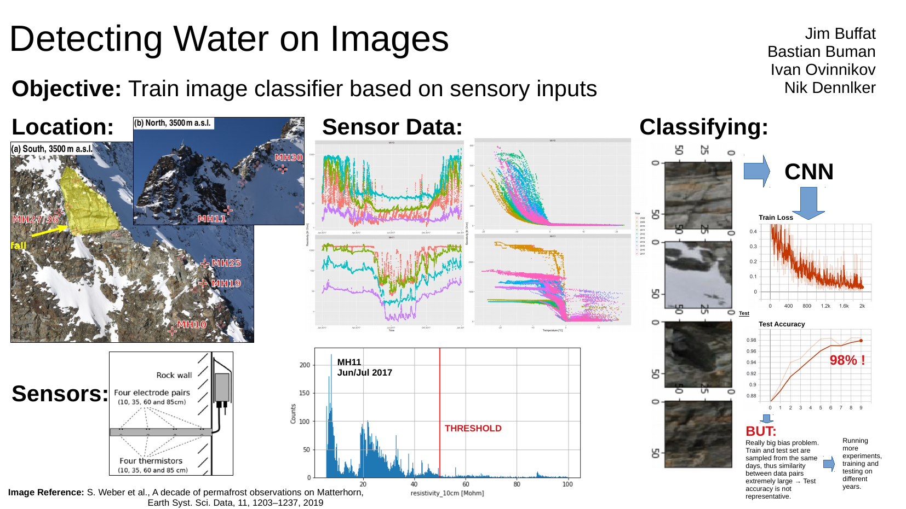

# HACKATHON PROJECT: Water Detection from Images
#### Group Members:
Jim Buffat (rrrr@posteo.ch) \
Bastian Buman (basian.buman@uzh.ch) \
Ivan Ovinnikov (ivan.ovinnikov@gmail.com) \
Tobias Schoch \ 
Nik Dennler (nik.dennler@uzh.ch)

#### Set Up 
1. Download and unzip following files to data folder: 

- timelapse_images.zip (2010-2018)
- timelapse_images_fast.zip (2017, Hackathon subset)
- timeseries_derived_data_products (2010-2018)
- timeseries_derived_data_products (2017 Hackathon subset)

2. Create train_data and test_data folders with 
0,1,2 subfolders respectively (according to number of classes)
TODO: automatize this step 

3. Open preprocessing.ipynb and adjust the paths accordingly
Run the entire notebook for multiple years consecutively
with YEAR_FLAG = 'train' and one year with YEAR_FLAG = 'test'
to generate the data in the test folder

4. Open classifier.ipynb and adjust train_data and test_data
paths. (Optional) inspect a couple of samples from dataloaders
as sanity check. Run the rest of the cells to start the training.

#### Visualize Data
There are different visualization toold within the folder 'visualize_data'. You might have to install the 'R' package in order to run some of them. 
